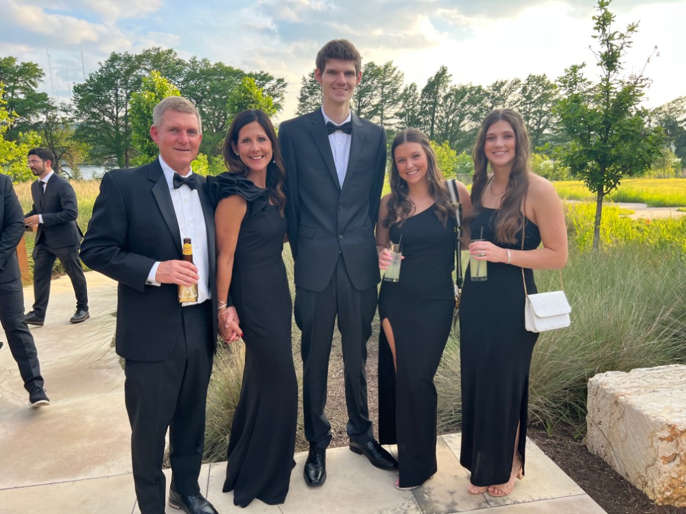

<!--Main blog text-->
# Jay's Blog:

## Was your first week what you expected? Why? Why not?
It was more than I expected to be honest mainly cause all I've been working with before was HTML, CSS and a little Javascript. Being introduced to git, github and gitpod has honestly been really confusing and getting them to connect/work together just hasn't been working for me.

## What are you excited or eager to learn more about?
I'm eager to get a better understanding of how git, gitpod, github and vscode work together to properly make things function correctly.

## What is something about you that can only be learned by reading this blog?
My name is Jay Miller, I am 21 years old and live in Lexington, KY. Two things you'll learn about me from reading this blog post are that I love to play basketball and video games.

## What is something you wish you could do but currently do not have the coding skills to accomplish?
I wish i could explain my coding process more and actually bge able to go over my code and explain what I did rather than what I did on our last demo day.
## What are you struggling with?
I would say I struggle with asking questions but mostly with staying focused and getting my work done. 
## How do you solve a problem?
Usually when I get stuck on something I troubleshoot by myself for about an hour or two and if i'm still stuck I ten to take a break and watch a video on it. However I should instead reach out and ask questions but I don't because I get distracted by other things like youtube. 
## What methods do you use to help yourself get unstuck?
Look up videos online or ask questions if I can't find the answer online